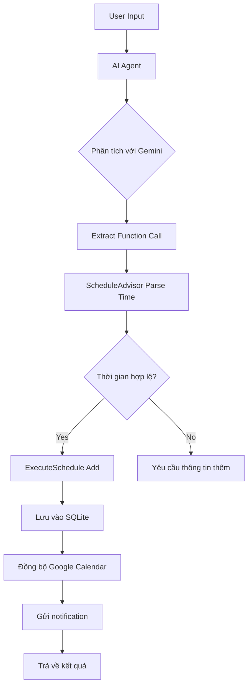
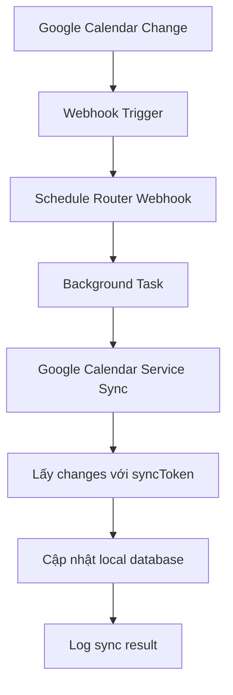
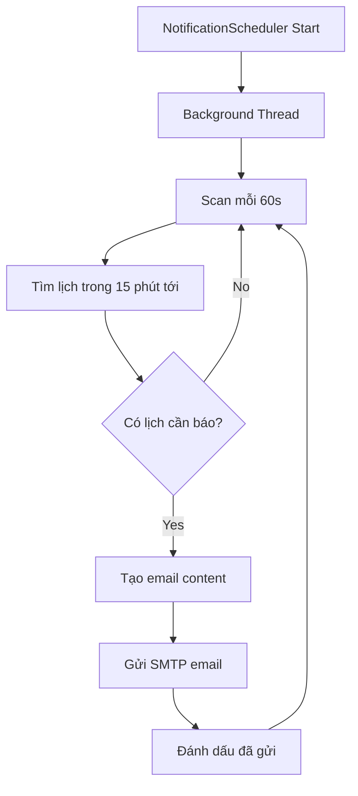

# Báo Cáo Hệ Thống Quản Lý Lịch Trình Thông Minh với AI Agent

## Tổng Quan Dự Án

### Giới Thiệu
Hệ thống Agent Schedule Management là một ứng dụng web thông minh được xây dựng để quản lý lịch trình cá nhân thông qua giao diện ngôn ngữ tự nhiên tiếng Việt. Hệ thống tích hợp AI để phân tích yêu cầu của người dùng và cung cấp khả năng đồng bộ hai chiều với Google Calendar cùng hệ thống thông báo email tự động.

### Mục Tiêu
- Cung cấp giao diện trò chuyện bằng tiếng Việt để quản lý lịch trình
- Tích hợp AI để hiểu và xử lý yêu cầu ngôn ngữ tự nhiên
- Đồng bộ tự động với Google Calendar
- Gửi thông báo email trước lịch hẹn
- Đề xuất thời gian phù hợp dựa trên lịch hiện có

### Đặc Điểm Nổi Bật
- Xử lý ngôn ngữ tự nhiên tiếng Việt với Google Gemini
- Đồng bộ hai chiều real-time với Google Calendar
- Hệ thống notification thông minh
- Giao diện web responsive
- API RESTful đầy đủ

## Kiến Trúc Hệ Thống

### Kiến Trúc Tổng Thể
Hệ thống được thiết kế theo mô hình **Microservices** với các module độc lập:

```
┌─────────────────┐    ┌─────────────────┐    ┌─────────────────┐
│   Frontend      │    │   AI Agent      │    │  Google APIs    │
│   (Web UI)      │◄──►│   (Gemini)      │◄──►│  (Calendar)     │
└─────────────────┘    └─────────────────┘    └─────────────────┘
                                │
                                ▼
┌─────────────────────────────────────────────────────────────────┐
│                    FastAPI Backend                              │
├─────────────────┬─────────────────┬─────────────────────────────┤
│  Schedule       │  Notification   │     Google Sync             │
│  Management     │  System         │     Service                 │
└─────────────────┴─────────────────┴─────────────────────────────┘
         │                       │                       │
         ▼                       ▼                       ▼
┌─────────────────┐    ┌─────────────────┐    ┌─────────────────┐
│   SQLite DB     │    │   SMTP Email    │    │   Webhook       │
│   (Local)       │    │   Service       │    │   Handler       │
└─────────────────┘    └─────────────────┘    └─────────────────┘
```

### Cấu Trúc Thư Mục

```
Agent-Schedule-Management/
├── main.py                       # Entry point chính
├── core/                         # Core business logic
│   ├── config.py                # Cấu hình tập trung
│   ├── ai_agent.py              # AI Agent chính
│   ├── exceptions.py            # Custom exceptions
│   ├── dependencies.py          # Dependency injection
│   ├── handlers/                # Request handlers
│   │   └── function_handler.py  # Xử lý function calls
│   ├── models/                  # Data models
│   │   ├── function_definitions.py  # AI function schemas
│   │   └── schema.py            # Database schemas
│   ├── services/                # Business services
│   │   ├── gemini_service.py    # Gemini AI integration
│   │   ├── ScheduleAdvisor.py   # Tư vấn lập lịch
│   │   ├── ExecuteSchedule.py   # Thực thi lịch
│   │   └── google_calendar_service.py  # Google Calendar sync
│   ├── notification/            # Notification system
│   │   ├── NotificationManager.py      # Manager tổng
│   │   ├── NotificationScheduler.py    # Background scheduler
│   │   └── NotificationCore.py         # Core services
│   ├── routers/                 # FastAPI routers
│   │   └── schedule_router.py   # API endpoints
│   └── OAuth/                   # Google credentials
│       └── credentials.json     # OAuth credentials
├── utils/                       # Utilities
│   ├── time_patterns.py        # Pattern matching thời gian
│   ├── task_categories.py      # Phân loại công việc
│   └── timezone_utils.py       # Xử lý múi giờ
├── database/                   # Database files
│   ├── schedule.db            # Lịch trình
│   └── user_config.db         # Cấu hình người dùng
└── test/                     # Test cases
    └── test_schedule_advisor.py
```

## Thiết Kế Chi Tiết

### 1. AI Agent Core (ai_agent.py)

**Chức năng:**
- Xử lý đầu vào ngôn ngữ tự nhiên từ người dùng
- Phân tích và điều hướng request đến các function phù hợp
- Tích hợp với Gemini AI để hiểu context

**Quy trình xử lý:**
```python
def process_user_input(self, user_input: str):
    # 1. Kiểm tra lệnh email
    email_command_result = self.notification_manager.process_user_input(user_input)
    
    # 2. Gọi Gemini để phân tích request
    system_prompt = self._build_system_prompt(user_input)
    response = self.gemini_service.generate_with_timeout(system_prompt, self.functions)
    
    # 3. Trích xuất function call
    function_call = self.gemini_service.extract_function_call(response)
    
    # 4. Thực thi function
    if function_call:
        return self.function_handler.handle_function_call(function_call, user_input)
    else:
        return self._handle_direct_response(user_input)
```

### 2. Schedule Advisor (ScheduleAdvisor.py)

**Chức năng:**
- Tư vấn thời gian lập lịch thông minh
- Phân tích pattern thời gian từ ngôn ngữ tự nhiên
- Kiểm tra xung đột lịch trình
- Đề xuất thời gian phù hợp

**Thuật toán tìm kiếm thời gian:**
```python
def find_available_time(self, duration_minutes: int, preferred_date: str = None):
    # 1. Xác định ngày tìm kiếm
    target_dates = self._get_search_dates(preferred_date)
    
    # 2. Lặp qua từng ngày
    for date in target_dates:
        # 3. Lấy lịch hiện có trong ngày
        existing_schedules = self._get_schedules_for_date(date)
        
        # 4. Tìm khoảng trống
        available_slots = self._find_free_slots(date, existing_schedules, duration_minutes)
        
        # 5. Trả về slot phù hợp nhất
        if available_slots:
            return self._select_best_slot(available_slots)
```

### 3. Google Calendar Service (google_calendar_service.py)

**Chức năng:**
- Đồng bộ hai chiều với Google Calendar
- Webhook handling cho real-time updates
- Incremental sync với sync token
- CRUD operations trên Google Calendar

**Cơ chế đồng bộ:**

#### a) Initial Sync
```python
def backfill_upcoming_days(self, days: int = 30):
    # Lấy events trong X ngày tới từ Google
    # Đồng bộ vào database local
```

#### b) Webhook Setup
```python
def start_watch(self, callback_url: str):
    # Đăng ký webhook với Google Calendar
    # Nhận notification khi có thay đổi
```

#### c) Incremental Sync
```python
def sync_from_google(self):
    # Sử dụng syncToken để lấy chỉ những thay đổi mới
    # Cập nhật database local
```

### 4. Notification System

#### a) NotificationManager
- Quản lý tổng thể hệ thống notification
- Khởi tạo và shutdown các service

#### b) NotificationScheduler
- Chạy background thread
- Scan database định kỳ
- Gửi email thông báo trước lịch hẹn

#### c) NotificationCore
- Email service (SMTP)
- Template service
- Database service
- User configuration

**Quy trình gửi notification:**
```python
def _check_and_send_notifications(self):
    # 1. Lấy email người dùng
    recipient_email = self.user_config_service.get_notification_email()
    
    # 2. Tìm lịch cần thông báo (15 phút trước)
    upcoming_schedules = self.db_service.get_upcoming_schedules(15)
    
    # 3. Gửi email cho từng lịch
    for schedule in upcoming_schedules:
        email_content = self.template_service.create_reminder_email(schedule_data)
        self.email_service.send_email(recipient_email, email_content)
        self.db_service.mark_notification_sent(schedule_id)
```

## Luồng Xử Lý Chính

### 1. Luồng Thêm Lịch Mới



### 2. Luồng Đồng Bộ Google Calendar



### 3. Luồng Gửi Thông Báo



## Use Cases

### UC1: Thêm Lịch Bằng Ngôn Ngữ Tự Nhiên

**Actor:** Người dùng

**Precondition:** Hệ thống đã khởi động, user đã truy cập web interface

**Main Flow:**
1. User nhập: "Đặt lịch khám răng lúc 2h chiều thứ 7"
2. Hệ thống phân tích với Gemini AI
3. Trích xuất thông tin: title="khám răng", time="14:00 Saturday"
4. Kiểm tra xung đột lịch
5. Thêm vào database và Google Calendar
6. Trả về xác nhận: "✅ Đã thêm lịch khám răng lúc 14:00, Thứ 7, 30/08/2025"

**Alternative Flow:**
- Nếu thời gian không rõ ràng → Hệ thống hỏi thêm thông tin
- Nếu bị trùng lịch → Đề xuất thời gian khác

### UC2: Tư Vấn Thời Gian Lập Lịch

**Actor:** Người dùng

**Main Flow:**
1. User nhập: "Khi nào tôi có thể họp team trong tuần này?"
2. Hệ thống phân tích lịch hiện có
3. Tìm các khoảng thời gian trống
4. Đề xuất 3-5 thời gian phù hợp
5. Trả về: "Bạn có thể họp team vào: Thứ 3 (9:00-11:00), Thứ 5 (14:00-16:00)..."

### UC3: Đồng Bộ Với Google Calendar

**Actor:** Hệ thống

**Main Flow:**
1. User thêm event trực tiếp trên Google Calendar
2. Google gửi webhook notification
3. Hệ thống nhận webhook
4. Trigger background sync
5. Lấy changes từ Google API
6. Cập nhật local database
7. Log sync result

### UC4: Gửi Thông Báo Email

**Actor:** NotificationScheduler

**Main Flow:**
1. Scheduler scan database mỗi 60 giây
2. Tìm lịch trong 15 phút tới chưa được báo
3. Lấy email của user từ config
4. Tạo email content từ template
5. Gửi email qua SMTP
6. Đánh dấu đã gửi thông báo

### UC5: Xem Lịch Hiện Tại

**Actor:** Người dùng

**Main Flow:**
1. User nhập: "xem lịch hôm nay" hoặc "danh sách lịch"
2. Hệ thống truy vấn database
3. Lọc lịch theo ngày/tuần/tháng
4. Format và trả về danh sách
5. Hiển thị: thời gian, tiêu đề, mô tả của từng lịch

### UC6: Cập Nhật Lịch

**Actor:** Người dùng

**Main Flow:**
1. User nhập: "đổi lịch họp ID 5 sang 10h sáng"
2. Hệ thống extract schedule_id và thông tin mới
3. Kiểm tra lịch tồn tại
4. Kiểm tra xung đột thời gian mới
5. Cập nhật database và Google Calendar
6. Trả về xác nhận

### UC7: Xóa Lịch

**Actor:** Người dùng

**Main Flow:**
1. User nhập: "xóa lịch ID 3"
2. Hệ thống kiểm tra lịch tồn tại
3. Xóa từ database local
4. Xóa từ Google Calendar (nếu có)
5. Trả về xác nhận

## Công Nghệ Sử Dụng

### Backend
- **FastAPI**: Web framework hiện đại, hỗ trợ async/await
- **SQLite**: Database nhẹ, phù hợp cho ứng dụng cá nhân
- **Python 3.11+**: Ngôn ngữ chính

### AI & Machine Learning
- **Google Gemini 1.5 Flash**: Large Language Model chính
- **Function Calling**: Structured output từ LLM
- **Natural Language Processing**: Xử lý tiếng Việt

### Google Integration
- **Google Calendar API v3**: Đồng bộ lịch
- **Google OAuth 2.0**: Authentication
- **Google Webhook**: Real-time sync

### Email & Notification
- **SMTP (Gmail)**: Gửi email thông báo
- **HTML Email Templates**: Email đẹp mắt
- **Background Threading**: Gửi không đồng bộ

### Development Tools
- **pyngrok**: Tunnel cho development
- **python-dotenv**: Quản lý environment variables
- **uvicorn**: ASGI server

### Database Schema

#### schedules table
```sql
CREATE TABLE schedules (
    id INTEGER PRIMARY KEY AUTOINCREMENT,
    title TEXT NOT NULL,
    description TEXT,
    start_time TEXT NOT NULL,
    end_time TEXT NOT NULL,
    created_at TEXT,
    google_event_id TEXT,        -- Đồng bộ Google
    google_etag TEXT,            -- Version control
    google_updated TEXT,         -- Last updated time
    deleted INTEGER DEFAULT 0,   -- Soft delete
    notified INTEGER DEFAULT 0,  -- Đã gửi thông báo
    notification_sent_at TEXT    -- Thời gian gửi thông báo
);
```

#### google_sync_state table
```sql
CREATE TABLE google_sync_state (
    id INTEGER PRIMARY KEY,
    calendar_id TEXT,
    next_sync_token TEXT,
    channel_id TEXT,
    resource_id TEXT,
    resource_uri TEXT,
    channel_expiration TEXT,
    last_sync_at TEXT
);
```

#### user_config table
```sql
CREATE TABLE user_config (
    id INTEGER PRIMARY KEY,
    key TEXT UNIQUE,
    value TEXT,
    created_at TEXT,
    updated_at TEXT
);
```

## Tính Năng Nâng Cao

### 1. Natural Language Processing
- Hỗ trợ nhiều cách diễn đạt thời gian tiếng Việt
- Pattern matching thông minh cho ngày/giờ
- Context awareness trong hội thoại

### 2. Smart Time Suggestion
- Phân tích lịch hiện có để tránh xung đột
- Đề xuất thời gian dựa trên work hours
- Tránh giờ ăn trưa và giờ nghỉ

### 3. Two-way Sync
- Đồng bộ real-time với Google Calendar
- Incremental sync để tối ưu performance
- Conflict resolution thông minh

### 4. Intelligent Notifications
- Thông báo 15 phút trước lịch hẹn
- Email template đẹp mắt
- Tránh spam với debounce mechanism

### 5. Error Handling & Resilience
- Retry mechanism cho API calls
- Graceful degradation khi service unavailable
- Comprehensive logging

## Kết Luận

Hệ thống Agent Schedule Management là một ứng dụng hoàn chỉnh tích hợp AI để quản lý lịch trình thông minh. Với thiết kế modular, hệ thống dễ dàng mở rộng và bảo trì. Việc sử dụng công nghệ hiện đại như FastAPI, Google Gemini, và Google Calendar API tạo ra một trải nghiệm người dùng mượt mà và hiệu quả.

Những điểm mạnh chính:
- **User Experience**: Giao diện ngôn ngữ tự nhiên tiếng Việt
- **Intelligence**: AI-powered schedule advising
- **Reliability**: Real-time sync với Google Calendar
- **Automation**: Email notification tự động
- **Scalability**: Kiến trúc modular dễ mở rộng

Hệ thống này phù hợp cho việc quản lý lịch trình cá nhân hoặc nhóm nhỏ, với khả năng mở rộng thành platform lớn hơn trong tương lai.
